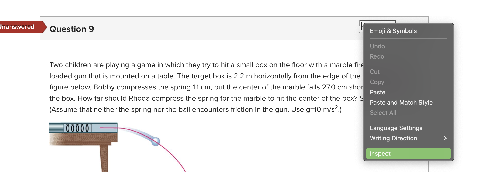
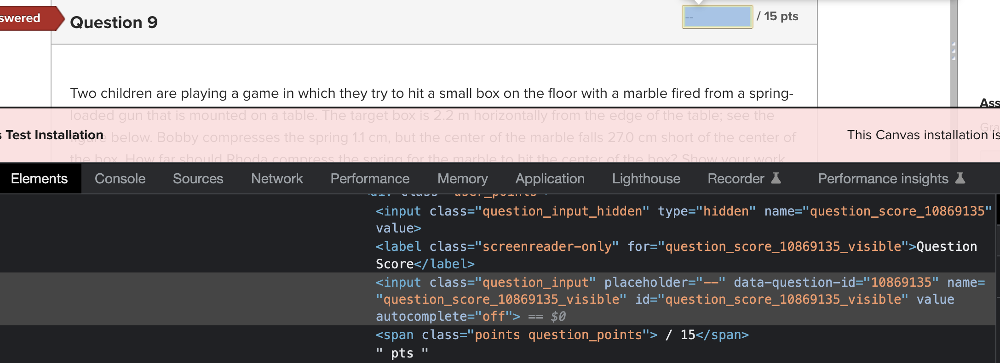

# Grades and attachments uploader for Canvas LMS

## Dependencies
1. argparse
2. dotenv
3. canvasapi 
> run `pip install -r requirements.txt` to install dependencies

## Usage
1. Make sure you have enough permissions.
2. Get your Canvas API key from your Canvas account following [steps](https://kb.iu.edu/d/aaja).
3. Copy your API key and paste it in the `.env` file.
4. Run `python [single_problem_quiz.py| multiple_problem_quiz.py]`. Details are shown below.
## Single problem quiz
**Description:**
Update the total score of a quiz and upload attachments for the quiz

**Usage:** 
`python single_problem_quiz.py [-h] -c COURSE_ID -a ASSIGNMENT_ID -e EXCEL_PATH -d DIR_PATH`

**Optional arguments:**
- `-h, --help`            show this help message and exit
-  `-c COURSE_ID`, `--course_id COURSE_ID`
                        ID of the course
-  `-a ASSIGNMENT_ID`, `--assignment_id ASSIGNMENT_ID`
                        ID of the assignment
-  `-e EXCEL_PATH`, `--excel_path EXCEL_PATH`
                        Path to Excel file that must include id and score columns
-  `-d DIR_PATH`, `--dir_path DIR_PATH`
                        Path to attachment directory. Naming of the files follows the format: `sectionId_lastName_firstName_studentId_SISLoginId_id.*`

**Example:**

> `python single_problem_quiz.py -c 130230 -a 3155457 -e ./test/resources/scores.xlsx -d ./test/resources/attachments`

### Tips on how to find `course_id` and `assignment_id` 
Open speed grader tab in canvas and copy the course ID and assignment ID from the URL. For example, if the URL is `https://osu.instructure.com/courses/130230/gradebook/speed_grader?assignment_id=3155457&student_id=1057113`, then the course ID is `130230` the assignment ID is `3155457` and the student_id is `1057113`.

## Multiple problem quiz 
**Description:** Update the score for a single problem in the quiz and upload attachments for the problem. 

**usage:** `python multiple_problems_quiz.py [-h] -c COURSE_ID -q QUIZ_ID -Q QUESTION_ID -a ASSIGNMENT_ID -e EXCEL_PATH -d DIR_PATH`

**optional arguments:**
-  `-h`, `--help`            show this help message and exit
 - `-c COURSE_ID`, `--course_id COURSE_ID`
                        ID of the course
-  `-q QUIZ_ID`, `--quiz_id QUIZ_ID`
                        ID of the quiz
-  `-Q QUESTION_ID`, `--question_id QUESTION_ID`
                        ID of the first question
-  `-a ASSIGNMENT_ID`, `--assignment_id ASSIGNMENT_ID`
                        ID of the assignment
-  `-e EXCEL_PATH`, `--excel_path EXCEL_PATH`
                        Path to Excel file that must include id and score columns
-  `-d DIR_PATH`, `--dir_path DIR_PATH`
                        Path to attachment directory
### Tips on how to find  `quiz_id` and `question_id`
Open a quiz tab in `Quizzes` and copy `quiz_id` from the url. For example, if the URL is `https://osu.instructure.com/courses/130230/quizzes/816752`, then the quiz ID is `816752`. To get the question_id, for example, if the URL is `https://osu.instructure.com/courses/130230/quizzes/816752/questions/3155458`, then the `question_id` is `3155458`. 

Unfortunately as a TA, I don't have the permission to access the second url. If you are also a TA, however, there is way around it to get the `question_id`. 

1. Open the speed grader tab. 
2. Right click on a question to show the developer tool.

3. Click inspect and find the `question_id` in the `data-question_id` tag attribute.

## Notice
- If you have an instructor role, you can get question_id directly from canvas api. 
- I tried web-scraping the speed-grader page in order to get `question_id` automatically. However it requires duo authentication. I am afraid there is no way around it using api. 
